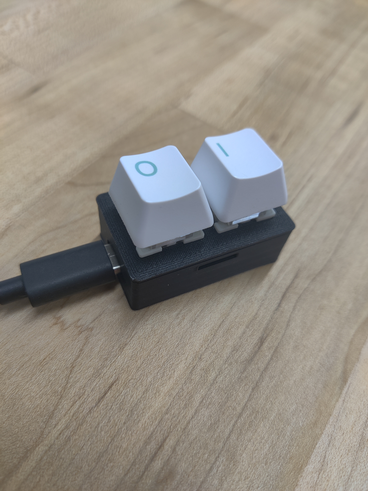

# BinaryAutoTyper

A physical keyboard that converts keystrokes to binary and back to ASCII, featuring a unique binary input mechanism and an automated keyboard presser.

## Overview

This project consists of two main components:
1. **Binary Keyboard**: A minimal keyboard with two buttons that allows typing any ASCII character using binary input.
2. **Auto Presser**: A mechanical system that automatically presses keys on a physical keyboard, controlled by the binary input.

## Hardware Components

### Binary Keyboard
- 1x Waveshare RP2040-Zero
- 2x Mechanical keyboard switches
- 2x Keycaps
- 26 AWG wire

### Auto Presser
- 1x Teensy 4.0
- 1x DRV8833 Motor Driver
- 1x 100μF capacitor
- 3x 0.1μF capacitors
- 2x Electric KK-0520B solenoids (5V, 600mA, 5mm travel, 0.2-5N)
- 22 AWG wire

### Enclosure
- 3D printed housing
- 6x 6x2mm magnets (optional)

## Communication Protocol

The communication between the Binary Keyboard and Auto Presser uses a custom binary protocol over serial. For detailed protocol specifications, see [PROTOCOL_DESIGN.md](PROTOCOL_DESIGN.md).

Key features:
- Single-byte encoding for all keyboard actions
- Support for all standard ASCII characters (0x20-0x7F)
- Dedicated modifier key handling (press/release)
- Comprehensive special key support (arrows, function keys, etc.)
- Emergency clear command (0x9E) for error recovery
- Efficient binary transmission with start symbol framing

## CAD Design

View the 3D model on [Onshape](https://cad.onshape.com/documents/a23f21f7142f74b01f919613/w/19e0e9d361a04868ba1185da/e/0e3bc4b0d31ba26d3ed0fc04?renderMode=0&uiState=678027edc156f43ca85e5772).



## Hardware Setup

### Binary Keyboard (RP2040-Zero)
1. Install CircuitPython on the RP2040-Zero
2. Copy these files to the RP2040:
   - `adafruit_debouncer.py`
   - `adafruit_ticks.py`
   - `code.py`
   - `adafruit_hid` library folder
3. Wire the switches:
   - One side to GND (pin 38)
   - Other side to GP2 (pin 4) and GP3 (pin 5)
4. The device will enumerate as a USB HID keyboard

### Auto Presser (Teensy 4.0)
1. Install the Arduino IDE with [Teensyduino](https://www.pjrc.com/teensy/td_download.html)
2. Wire the DRV8833 as follows:
   - Channel A: IN1 → GPIO 3, IN2 → GND
   - Channel B: IN3 → GND, IN4 → GPIO 2
   - EEP → GPIO 5
   - Add 100μF and 0.1μF capacitors between VCC and GND
   - Add 0.1μF capacitors across OUT1-OUT2 and OUT3-OUT4
3. Connect solenoids to OUT1 and OUT2
4. Upload the `keyPresserTeensy4.ino` sketch
5. Select "Teensy 4.0" from the board menu

## Software Installation

### Binary Keyboard (RP2040-Zero)
1. Download and install [CircuitPython for RP2040-Zero](https://circuitpython.org/board/waveshare_rp2040_zero/)
2. Copy these files to the RP2040:
   - `adafruit_debouncer.py`
   - `adafruit_ticks.py`
   - `code.py`
   - `adafruit_hid` library folder

### Auto Presser (Teensy 4.0)
1. Install the [Teensyduino add-on](https://www.pjrc.com/teensy/td_download.html)
2. Open the `keyPresserTeensy4.0.ino` sketch in Arduino IDE
3. Select "Teensy 4.0" from the board menu
4. Upload the sketch

## Usage

1. Connect both devices to power
2. The Binary Keyboard will appear as a USB HID device
3. The Auto Presser will connect as a USB keyboard
4. Use the binary input to type characters (see input method below)

### Binary Input Method
- Left button: 0 bit
- Right button: 1 bit
- Both buttons held for 40ms: Start symbol (begin transmission)
- After start symbol, enter 8 bits (LSB first)
- The byte is automatically sent after 8 bits
- Emergency clear: Send 0x9E (10011110 in binary)

## Troubleshooting

### Binary Keyboard Issues
- **Not recognized by computer**:
  - Check USB connection
  - Verify CircuitPython is installed correctly
  - Check for `code.py` in root directory

- **Keys not registering**:
  - Verify switch wiring (GND to one side, GP2/GP3 to other)
  - Check for proper pull-up resistors (enabled in code)
  - Test with serial output for debugging

### Auto Presser Issues
- **Solenoids not firing**:
  - Verify DRV8833 power (5V, sufficient current)
  - Check EEP pin is HIGH (enables outputs)
  - Test solenoids directly with 5V

- **Communication issues**:
  - Ensure baud rate matches (115200)
  - Verify TX/RX connections between RP2040 and Teensy
  - Check for proper ground connection between boards

### Protocol Issues
- **Stuck keys**: Send emergency clear (0x9E)
- **Incorrect characters**: Verify bit order (LSB first)
- **Timing issues**: Check start symbol timing (40ms window)

## Resources
  - Serial terminal for testing ([online version I used](https://www.serialterminal.com/advanced_terminal/src/html/index.html))
- [RP2040-Zero Documentation](https://www.waveshare.com/wiki/RP2040-Zero)
- [Teensy 4.0 Documentation](https://www.pjrc.com/store/teensy40.html)
- [DRV8833 Datasheet](https://www.ti.com/lit/ds/symlink/drv8833.pdf)
- [ASCII Table](https://www.ibm.com/docs/en/aix/7.2?topic=adapters-ascii-decimal-hexadecimal-octal-binary-conversion-table)

## Protocol Implementation Details

### Binary Keyboard (RP2040-Zero)

#### Pin Configuration
```python
# In code.py
PINS = (
    board.GP2,  # Left button (0 bit) - Pin 4
    board.GP3   # Right button (1 bit) - Pin 5
)
```

#### Key Features
- Debounced button inputs
- Start symbol detection (both buttons pressed)
- LSB-first bit transmission
- Automatic byte transmission after 8 bits
- Emergency clear functionality

#### Required Libraries
- `adafruit_debouncer` - For button debouncing
- `adafruit_ticks` - For timing operations
- `adafruit_hid` - For USB HID emulation

### Auto Presser (Teensy 4.0)

#### Pin Configuration
```cpp
// In keyPresserTeensy4.ino
const int SOL0_PIN = 3;      // DRV8833 IN1
const int SOL1_PIN = 2;      // DRV8833 IN4
const int DRV8833_ENABLE_PIN = 5;  // EEP
```

#### Timing Parameters
```cpp
constexpr uint32_t PULSE_US = 25000;  // 25ms solenoid pulse
constexpr uint32_t GAP_US = 15000;    // 15ms between bits
constexpr uint32_t TICK_US = 25;      // ISR tick period
```

#### Key Features
- USB Host for keyboard input
- Protocol decoding state machine
- Solenoid control with proper timing
- Modifier key state tracking
- Emergency key clearing

### Auto Presser (Teensy 4.0)

The Auto Presser uses a DRV8833 motor driver to control the solenoids. The current implementation uses the following pins:

```
// Pin definitions for Teensy 4.0
const int SOLENOID_0_PIN = 2;  // IN4 on DRV8833
const int SOLENOID_1_PIN = 3;  // IN1 on DRV8833
const int ENABLE_PIN = 5;      // EEP on DRV8833
```

### Circuit Design

The DRV8833 circuit includes:
- Power supply filtering with 100μF and 0.1μF capacitors
- Solenoid filtering with 0.1μF capacitors across outputs
- Proper grounding and power distribution

For more information on solenoid driving circuits, see this [helpful resource](http://www.robotsforfun.com/webpages/electromagnet.html).

## Troubleshooting Common Issues

### Binary Keyboard Not Detected
- Verify USB connection
- Check that the device appears as a USB HID device
- Ensure proper power supply

### Keys Not Registering
- Check switch wiring and continuity
- Verify button pins in code match physical connections
- Test with serial debug output if available

### Solenoids Not Firing
- Check DRV8833 power supply (5V, sufficient current)
- Verify enable pin is HIGH
- Test solenoids directly with 5V
- Check for proper ground connections

## Future Improvements

- Add wireless communication between keyboard and presser
- Implement different input modes (e.g., hex, decimal)
- Add LCD display for status and input feedback
- Create a more robust mechanical design

## License

This project is open source and available under the MIT License.

## Acknowledgments

- [Adafruit](https://adafruit.com) for CircuitPython and libraries
- [PJRC](https://www.pjrc.com/) for the Teensy platform
- The open-source hardware community for inspiration and support