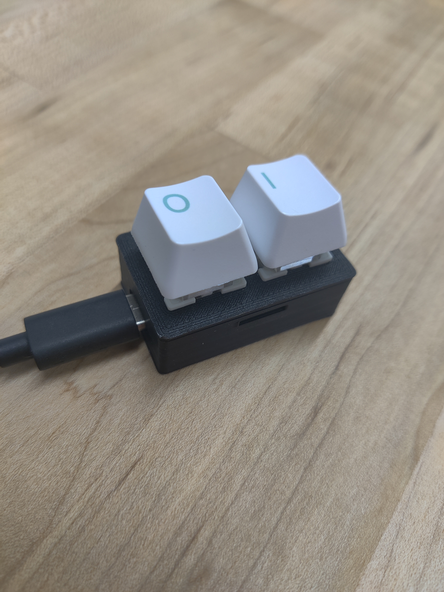

# BinaryAutoTyper
#### A little desk gizmo that converts keystrokes to binary then back to ASCII for your delight! 

Currently working on the [CAD](https://cad.onshape.com/documents/a23f21f7142f74b01f919613/w/19e0e9d361a04868ba1185da/e/0e3bc4b0d31ba26d3ed0fc04?renderMode=0&uiState=678027edc156f43ca85e5772) and have only implemented the binary keyboard part so far.

[RP2040 Info](https://www.waveshare.com/wiki/RP2040-Zero)

### BOM:
  - 2 rp2040-zero
  - 2 Mechanical keyboard switches
  - 2 keycaps
  - 2 2N2222 transistors
  - 2 Electric KK-0520B solenoid (5V,  600ma, 5mm travel, 0.2-5N)
  - some wire
  - 3D printed housing
  - 4 small bolts
  - 6 6x2mm magnets (optional)

### TOOLS:
  - Solder
  - Soldering iron

### Software needed:
  - [Circuit Python](https://circuitpython.org/board/waveshare_rp2040_zero/   ) ([how to install](https://learn.adafruit.com/getting-started-with-raspberry-pi-pico-circuitpython/circuitpython))
  - Serial terminal for testing ([online version I used](https://www.serialterminal.com/advanced_terminal/src/html/index.html))

### Steps:
- Install circuitpython to the RP2040 [I used this one](https://github.com/GQster/BinaryAutoTyper/blob/main/adafruit-circuitpython-waveshare_rp2040_zero-en_US-9.2.2.uf2)
- Copy the `adafruit_debouncer.py` & `adafruit_ticks.py` to the root folder. ( I got ticks from [here](https://github.com/adafruit/Adafruit_CircuitPython_Ticks/blob/main/adafruit_ticks.py) and debouncer from [here](https://github.com/adafruit/Adafruit_CircuitPython_Debouncer/blob/main/adafruit_debouncer.py) ) (Did this as I couldn't get the lib for these to work)
- In the adafruit-circuitpython*****.zip [I got from here](https://circuitpython.org/libraries), copy the `lib/adafruit_hid` folder to the rp2040's lib folder.
- Copy the `code.py` [file](https://github.com/GQster/BinaryAutoTyper/blob/master/code.py) to the root of the rp2040

**Wire it up:**
- Solder one side of each key to a GND pin (I used pin 2)
- Solder the other pin of each key to a GPIO pin. I used 2, and 3 (avoiding the UART pins). Make sure you update the code with your pins:

`PINS = (
    board.GP2,
    board.GP3
)`

## NOTE:
I was having issues importing the libraries correctly and didn't want to spend the time to fix it. So I just copied the `adafruit_ticks` and `adafruit_debounce` files into the root folder. This work fine, but is messy. 

[Binary to ASCII table](https://www.ibm.com/docs/en/aix/7.2?topic=adapters-ascii-decimal-hexadecimal-octal-binary-conversion-table)

If you want to read more on the circuitry involved in this project [this is a good resource](http://www.robotsforfun.com/webpages/electromagnet.html)

